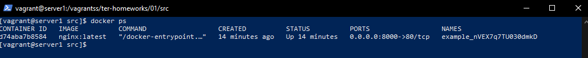
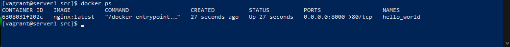
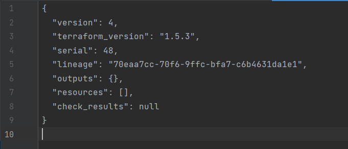
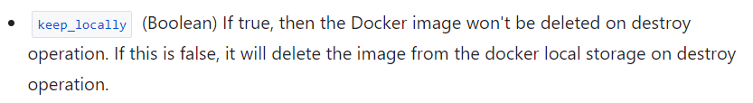
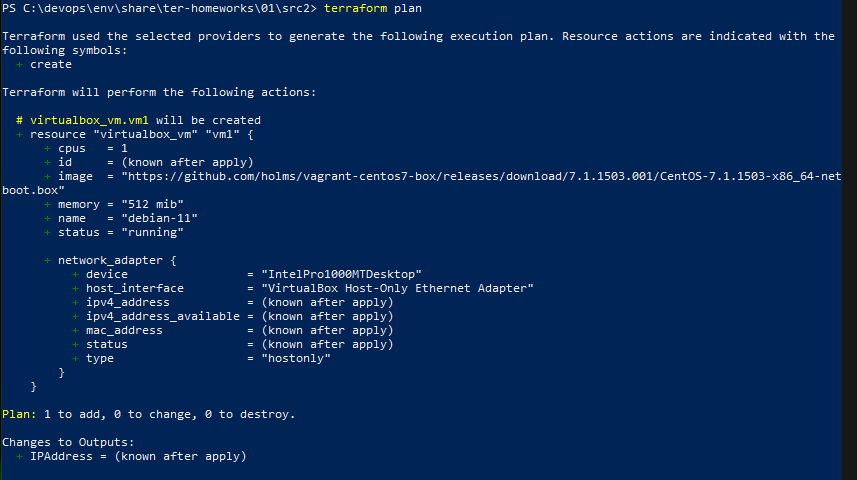
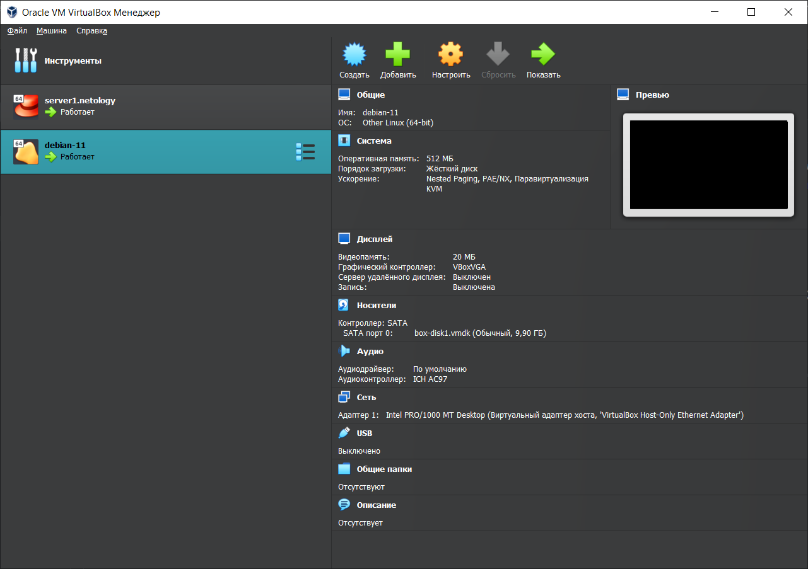

## Задание 1
* согласно файлу .gitignore файлы персональными данными не передаются в репозиторий
* "result": "nVEX7q7TU030dmkD"
* ошибки: в ресурсе docker_image отсутствует название, имя ресурса docker_container начинается с цифры, параметр ресурса docker_container ссылается на корректные для докера данные, имя ссылается на несуществующий параметр ресурса random_password
* 
* Опасность ключа -auto-approve в том, что если в конфигурации будет ошибка, то она будет проигнорирована, что может привести к потере данных
* 
* Образ nginx не был удален из-за параметра keep_locally, который задает сохранять ли образ при выполнении команды destroy 

## Задание 2
* 
* 