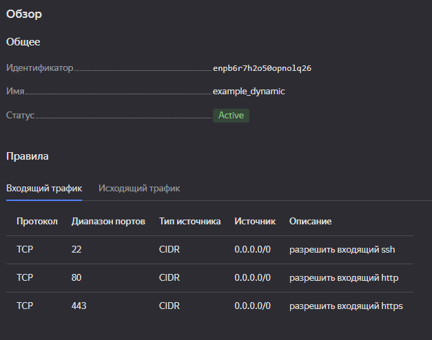
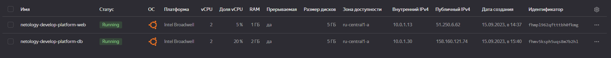
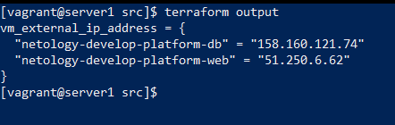

## Задание 1

Ошибки: некорректная версия платформы, неправильно написано слово standard, некорректное количество ядер, минимум 2

## Задание 2
Выполнено, terraform plan показал отсутствие изменений

## Задание 3

## Задание 4

## Задание 5
Выполнено, terraform plan показал отсутствие изменений

## Задание 6
Выполнено, terraform plan показал отсутствие изменений